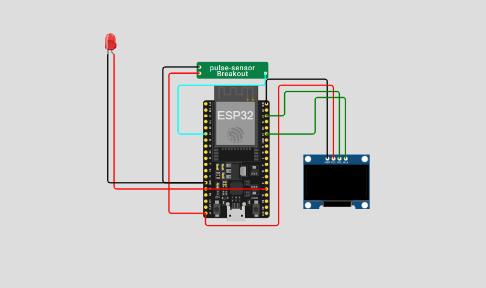

# **Medidor de Batimentos Cardíacos**

Este repositório implementa um sistema de **monitoramento da frequência cardíaca**, utilizando um ESP32, sensor de batimentos (Pulse Sensor Breakout), LED de alerta e display OLED SSD1306. A comunicação ocorre via protocolo MQTT, e há visualização local via display, com possibilidade de integração futura com dashboards ou aplicativos de saúde.

---

## 📷 Protótipo

> *Simulação feita no [Wokwi](https://wokwi.com/).*



---

## 🔧 Componentes Utilizados

* **Placa:** ESP32 DevKitC V2 (simulado no Wokwi)
* **Sensor:** 1× Pulse Sensor Breakout (detecta variação de fluxo sanguíneo)
* **Atuador:** 1× LED vermelho (alerta para BPM fora do intervalo normal)
* **Display:** OLED SSD1306 128×64 I2C (endereço `0x3C`)
* **Comunicação:** Wi-Fi + MQTT via `test.mosquitto.org:1883`

---

## ⚙️ Como Funciona

1. **Leitura**
   O sensor Pulse Sensor Breakout mede a variação do fluxo sanguíneo nos vasos, detectando cada batimento cardíaco.

2. **Cálculo da frequência**
   O valor analógico do sensor é convertido em batimentos por minuto (BPM).

3. **Controle do LED**

   * Se o BPM estiver **abaixo de 50**, o **LED vermelho acende** e o display mostra “Batimento abaixo”.
   * Se o BPM estiver **entre 50 e 120**, o **LED permanece apagado** e o display mostra “Batimento normal”.
   * Se o BPM estiver **acima de 120**, o **LED vermelho acende** e o display mostra “Batimento acima”.

4. **Exibição local**
   O OLED mostra em tempo real a quantidade de BPM e o status do batimento.

5. **MQTT**

   * Publicação em tópicos:

     * `coracao/batimento` (valor em BPM)
     * `coracao/situacao` (status: normal, abaixo ou acima)
   * Broker: `test.mosquitto.org` porta `1883` via TCP/IP.
   * Cliente MQTT: PubSubClient para ESP32.

---

   ## 📁 Estrutura de Arquivos

```plaintext
├── sketch.ino       # Código principal do projeto
├── diagram.json     # Diagrama do circuito no Wokwi
├── pulse-sensor.chip.json  # Configuração do sensor customizado no Wokwi
├── pulse-sensor.chip.c     # Código do chip customizado do sensor
└── libraries.txt    # Bibliotecas necessárias

---

## 🚀 Simulação no Wokwi

1. Acesse [https://wokwi.com](https://wokwi.com)
2. Crie um novo projeto e faça upload de:
   * `sketch.ino`
   * `diagram.json`
   * `libraries.txt`
   * `pulse-sensor.chip.json`
   * `pulse-sensor.chip.c`
3. Clique em **Start Simulation**
4. Abra o **Serial Monitor** e observe o **OLED** mostrando BPM e status

---

## Interfaces e Protocolos

Este projeto utiliza comunicação via protocolo **MQTT** (Message Queuing Telemetry Transport), com os seguintes detalhes:

* **Broker:** `test.mosquitto.org`
* **Porta:** `1883`
* **Transporte:** TCP/IP
* **Client Library:** PubSubClient para ESP32

### Publicações (ESP32 → Broker)

| Tópico               | Descrição                              |
| -------------------- | -------------------------------------- |
| `coracao/batimento`  | Valor dos batimentos por minuto (BPM) |
| `coracao/situacao`   | Status do batimento (normal/abaixo/acima) |

---

## 🔄 Possíveis Extensões

* Dashboard remoto para monitoramento contínuo dos batimentos
* Alertas via e-mail ou app em caso de BPM fora do intervalo
* Integração com smartwatch ou aplicativos de saúde

---

## 📜 Licença

Este projeto está licenciado sob a MIT License. Veja o arquivo `LICENSE` para mais detalhes.

